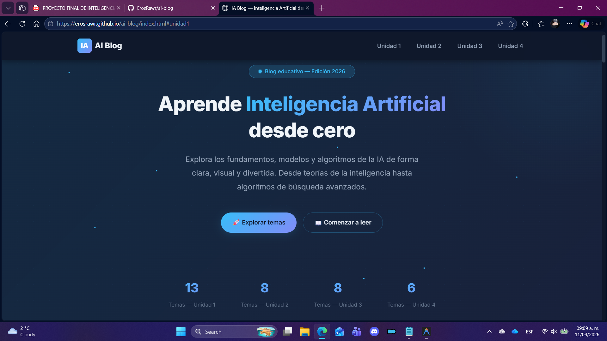

# Blog de Inteligencia Artificial

Blog educativo e interactivo sobre los fundamentos de la Inteligencia Artificial,
desarrollado con HTML, CSS y JavaScript puro como proyecto final del curso de IA
— Universidad Autónoma de Coahuila, FIME.

---

## Demo en vivo

[Ver blog en GitHub Pages](https://erosrawr.github.io/ai-blog)

---

## Vista previa



---

## Contenido del blog

El blog cubre 4 unidades completas del curso de Inteligencia Artificial:

### Unidad I — Introducción a la IA
- 1.1 Introducción a la Inteligencia Artificial
- 1.2 Historia de la IA
- 1.3 Habilidades cognoscitivas según la psicología
- 1.4 Proceso de razonamiento lógico (Axiomas, Teoremas)
- 1.5 Modelo de adquisición del conocimiento
- 1.6 Modelo cognoscitivo
- 1.7 Agente inteligente, Sistemas Multi-Agente y Sistemas Ubicuos
- 1.8 El papel de la heurística
  - 1.8.1 Algoritmos de exploración de alternativas
  - 1.8.2 Algoritmo A*
  - 1.8.3 Algoritmos de búsqueda local

### Unidad II — Representación del Conocimiento y Razonamiento
- 2.1 Principios y Metodología de la IA
- 2.2 Paradigmas de la IA
- 2.3 Mapas conceptuales
- 2.4 Redes semánticas
- 2.5 Razonamiento monótono
- 2.7 Conocimiento no-monótono y otras lógicas
- 2.8 Razonamiento probabilístico
- 2.9 Teorema de Bayes

### Unidad III — Reglas y Búsqueda
- 3.1 Representación del conocimiento mediante reglas
- 3.2 Métodos de inferencia en reglas
- 3.3 Reglas de producción
- 3.4 Sintaxis de las reglas de producción
- 3.5 Semántica de las reglas de producción
- 3.6 Arquitectura de un Sistema de Producción
- 3.7 Espacios de estados determinísticos y no determinísticos
- 3.8 Búsqueda sistemática (profundidad y anchura)

### Unidad IV — Aplicaciones con Técnicas de IA
- 4.1 Robótica
- 4.2 Redes Neuronales
- 4.3 Visión Artificial
- 4.4 Lógica Difusa (Fuzzy Logic)
- 4.5 Procesamiento de Lenguaje Natural (PLN)
- 4.6 Sistemas Expertos

---

## Características

| Característica | Descripción |
|---|---|
| Diseño moderno | Tema oscuro con efectos glassmorphism |
| Responsivo | Compatible con escritorio y móvil |
| Quiz interactivo | Evaluación por tema con retroalimentación visual |
| Recursos multimedia | Videos embebidos por tema |
| Reportes en PDF | Descarga de prácticas por tema |
| Sin frameworks | HTML, CSS y JS vanilla puro |
| GitHub Pages | Desplegado y accesible en línea |
| Animaciones | Efectos suaves con Intersection Observer |

---

## Tecnologías utilizadas

- HTML5
- CSS3
- JavaScript (Vanilla)
- GitHub Pages

Sin frameworks ni librerías externas. Todo desarrollado desde cero.

---

## Estructura del proyecto

```
/ai-blog
│
├── index.html                  # Página principal
│
├── css/
│   ├── styles.css              # Estilos globales
│   └── animations.css          # Animaciones y transiciones
│
├── js/
│   ├── main.js                 # Lógica principal
│   └── quiz.js                 # Componente de evaluaciones
│
├── pages/
│   ├── unidad1/                # Páginas Unidad I
│   ├── unidad2/                # Páginas Unidad II
│   ├── unidad3/                # Páginas Unidad III
│   └── unidad4/                # Páginas Unidad IV
│
└── assets/
    ├── img/                    # Imágenes del blog
    └── pdf/                    # Reportes de prácticas
```

---

## Como ejecutar el proyecto

Opción 1 — Abrir directo en el navegador:

```bash
git clone https://github.com/ErosRawr/ai-blog.git
open index.html
```

Opción 2 — Con Live Server (recomendado para desarrollo):
Clic derecho en index.html en VS Code y selecciona "Open with Live Server".

Opción 3 — Ver en línea:
https://erosrawr.github.io/ai-blog

---

## Contenido mínimo por tema

Cada tema del blog incluye:

- [x] Nombre del tema y subtemas
- [x] Fundamento teórico
- [x] Práctica y actividades
- [x] Reporte en PDF descargable
- [x] Video explicativo embebido
- [x] Evaluación con cuestionario interactivo
- [x] Conclusión sobre el tema
- [x] Referencias en formato APA

---

## Evaluación del proyecto

| Criterio | Puntos |
|---|---|
| Explicación teórica clara y completa | 20 |
| Ejercicio práctico y reportes | 20 |
| Implementación de problemas reales | 20 |
| Interfaz del blog (organización, diseño, navegación) | 15 |
| Originalidad, creatividad y recursos multimedia | 15 |
| Redacción, ortografía y presentación | 10 |
| Total | 100 |

---

## Autor

Paolo Berumen
Estudiante de Ingeniería en Sistemas Computacionales
Universidad Autónoma de Coahuila — FIME
Semestre 9 — 2025

---

## Información académica

| Campo | Detalle |
|---|---|
| Materia | Inteligencia Artificial |
| Docente | M.I. Liliana Guadalupe Alonso Sanchez |
| Carrera | ISC — Semestre 9 |
| Entrega | 25 de mayo de 2026 |
| Institución | Universidad Autónoma de Coahuila |

---

## Licencia

Este proyecto es únicamente para fines educativos.
2025 Paolo Berumen — Universidad Autónoma de Coahuila
